# Efeitos de Pólos e Zeros na Dinâmica

## Apresentação do Laboratório

### Objetivo

Nesta experiência, verificaremos a influência dos pólos e zeros de uma Função de Transferência na resposta dinâmica para entradas do tipo degrau e também para entradas senoidais. Utilizaremos o Matlab para realizar as
simulações.

### Polos e Zeros

Considere uma função de Trasnferência da forma

$$
G(s) = \frac{Y(s)}{U(s)} = \frac{N(s)}{D(s)} = \frac{b_1s^m +b_2s^{m-1} + \dots + b_ms + b_{m+1}}{s^n + a_1s^{n-1}+ \dots + a_{n-1}s + a_n}
$$

onde $Y(s)$ é a saída, $U(s)$ é a entrada, $n \geq m$ e todos os coeficientes são reais. Temos as seguintes definições:

1. Os pólos $G(s)$ são as raízes de $D(s)$ ($D(s) = 0$);
2. Os *zeros* de $G(s)$ são as raízes de $N(s)$ ($N(s) = 0$);
3. $G(s)$ é *estável* quando todos os pólos possuem parte real negativa, ou seja, estão no semi-plano esquerdo (SPE) do plano $s$;
4. $G(s)$ é *instável* quando existe ao menos um pólo com parte real positiva, ou seja, no semi-plano (SPD);
5. $G(s)$ é de *fase não-mínima* quando há polos ou zeros no SPF.

Considere que $G(s)$ é estável, ou seja, todos os pólos estão no SPE. Em geral, para entradas do tipo degrau, temos:

1. A componente da resposta dinâmica referente a um pólo afastado da origem (do plano $s$) é relativamente rápida;
2. A componente da resposta dinâmica referente a um pólo próximo da origem é relativamente lenta;
3. Um zero tende a fazer com que a resposta dinâmica apresente sobressinal. Quanto mais próximo da origem estiver o zero, maior o sobressinal. E, quanto mais longe da origem, menor se torna o sobressinal, podendo o mesmo não existir. Assim, um sistema de segunda ordem com pólos reais e um zero poderá apresentar um sobressinal dependendo do posicionamento do zero no plano $s$;
4. Um zero bem próximo de um pólo tende a anular os efeitos dos mesmos na resposta dinâmica.

## Procedimentos

### Problema 1{-}

Considere o sistema de primeira ordem
$$
G(s) = \frac{1}{\tau s +1},
$$
onde $\tau = 1$, $\tau = 0.5$. Para cada valor de $\tau$, determine o pólo e sua posição no plano $s$ (use os comandos `zpk` e `pzmap` no Matlab), e conclua sobre a estabilidade e a rapidez da resposta do sistema. Simule para uma entrada do tipo degrau unitário. Analise e compare os resultados. Agora, repita o procedimento para o sistema
$$
G(s) = \frac{1}{s-1}.
$$

#### Resolução {-}

A resolução será feita em quatro partes: (1) a resolução para $\tau = 1$ usando `pzmap`, (2) a resolução para $\tau = 0.5$ usando `pzmap`, (3) a simulação e comparação dos resultados e, por fim, (4) a resolução para $G(s) =\frac {1}{s-1}$.

##### Parte 1 {-}

Para $\tau = 1$, temos a função de transferência dada por 
$$
G(S)= \frac {1}{s+1}.
$$

O código implementado no `Matlab` foi o apresentado abaixo.

```{matlab}
g = tf([1], [1 1])
[p, z] = pzmap(g)
pzmap(g)
```

Tendo como resultados de polos e zeros:

```
p =

    -1


z =

  0×1 empty double column vector
```

Ou seja, a função de transferência não apresenta zeros e tem seu polo em $s = -1$. A sua posição no plano é apresentada na figura abaixo.


Como o polo da função de transferência se encontra na SPE, conclui-se que o sistema se compartará de uma forma estável.

##### Parte 2 {-}

Para $\tau = 0.5$, temos a função de transferência dada por 
$$
G(S)= \frac {1}{0.5s+1}.
$$

O código implementado no `Matlab` foi o apresentado abaixo.

```{matlab}
g = tf([1], [0.5 1])
[p, z] = pzmap(g)
pzmap(g)
```

Tendo como resultados de polos e zeros:

```
p =

    -2


z =

  0×1 empty double column vector
```

Ou seja, a função de transferência não apresenta zeros e tem seu polo em $s = -2$. A sua posição no plano é apresentada na figura abaixo

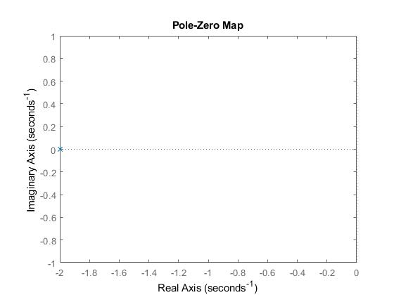

Como o polo da função de transferência se encontra na SPE, conclui-se que o sistema se compartará de uma forma estável. Também é possível concluir que o sistema alcanraça a estabilidade mais rápido para $\tau = 0.5$.

##### Parte 3 {-}

A simulação do sistema implementada em `Matlab` está apresentado na figura abaixo.

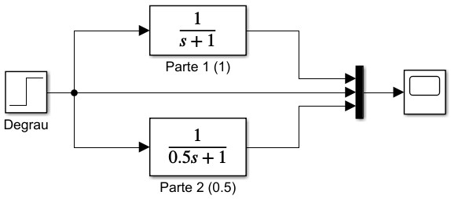

O resultado apresentado pelo *scope* é apresentado na figura abaixo.

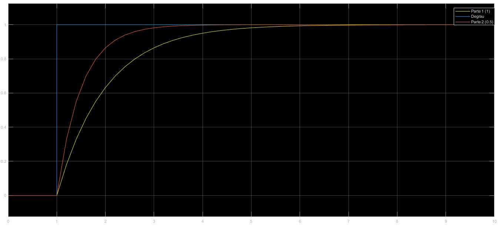

Percebe-se que, assim como esperado, o sistema se comporta de forma estável e tem uma convergência mais rápida para $\tau = 0.5$.

##### Parte 4 {-}

Para a última etapa temos a função de transferência dada por 
$$
G(S)= \frac {1}{s-1}.
$$

O código implementado no `Matlab` foi o apresentado abaixo.

```{matlab}
g = tf([1], [1 -1])
[p, z] = pzmap(g)
pzmap(g)
```

Tendo como resultados de polos e zeros:

```
p =

    1


z =

  0×1 empty double column vector
```

Ou seja, a função de transferência não apresenta zeros e tem seu polo em $s = 1$. A sua posição no plano é apresentada na figura abaixo

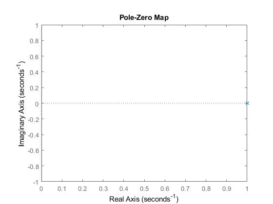

Como o polo da função de transferência se encontra na SPD, conclui-se que o sistema se compartará de uma forma instável. A simulação em `Matlab` está apresentada na figura abaixo.


O resultado apresentado pelo *scope* é apresentado na figura abaixo.

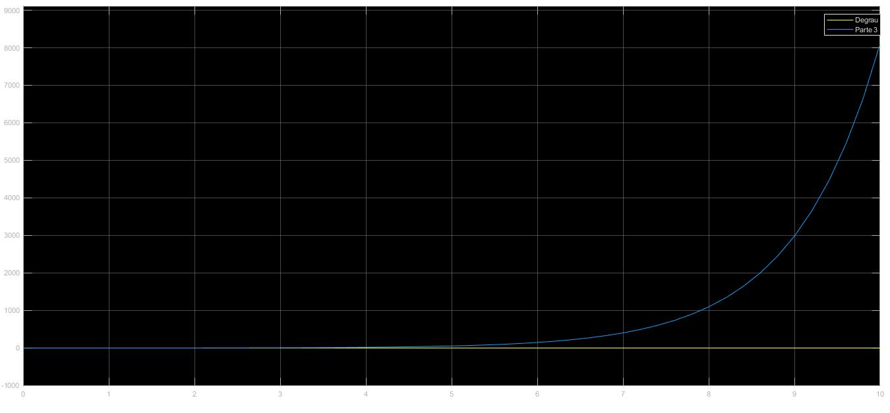

O resultado comprova o esperado. O sistema se comporta de forma instável para a função de transferência dada por $G(s) = \frac {1}{s-1}$.


### Problema 2{-}

Considere o sistema de primeira ordem (integrador)
$$
G(s) = \frac {1}{s}.
$$

Determine o pólo e a sua posição no plano $s$ e simule para uma entrada do tipo degrau unitário e também para $\sin {(t)}$ (para  $\sin {(t)}$, escolha **Max Step Size = 0.1** em **Simulation $\implies$ Configurarion Parameters**). Note que a saída é a integral da entrada. Tais resultados eram esperados? Dica: relembre que $Y(s) = G(s)U(s)$, e que se $x(t) \iff X(S)$, então $\int_0^t x(\tau) \mathrm{d}\tau \iff X(s)/s$.

#### Resolução {-}

O código utilizado no `Matlab` é apresentado abaixo.

```{matlab}
g = tf([1], [1 0])
[p,z] = pzmap(g)
pzmap(g)
```

Obtendo como resultado:

```
p =

     0


z =

  0×1 empty double column vector
```

Conclue-se então que a função de transferência $G(s) = \frac {1}{s}$ não tem zeros e tem pólo em $s = 0$. O mapa da posição no plano é mostrado na figura abaixo.

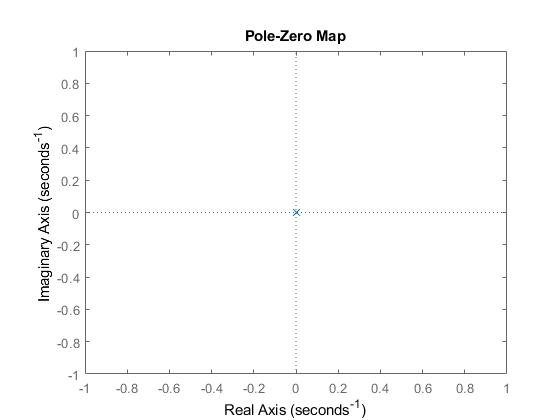

Isso mostra que o sistema é um caso crítico. Neste caso a resposta em regime permanente do sistema a uma entrada de amplitude limitada será uma senóide.

A simulação feita em `Matlab` está apresentada na figura abaixo.

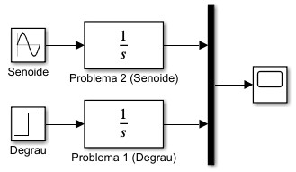

O resultado da simulação é apresentado na figura abaixo.

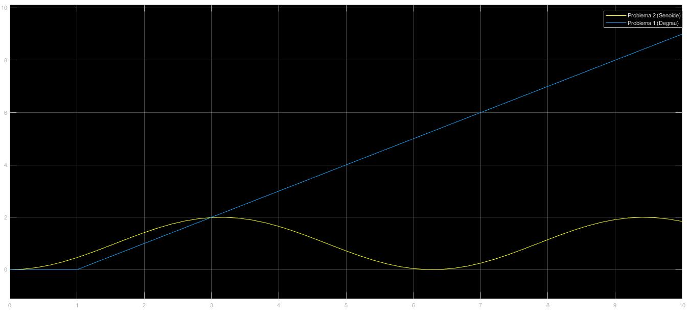

O resultados eram esperados, uma vez que em um estado crítico a função de transferência pode estar em um estado permanente senoidal caso a entrada seja senoidal ou pode divergir caso a entrada seja um sinal constante.


### Problema 3{-}

Considere o sistema de segunda ordem
$$
G(s) = \frac {1}{s^2 +25}.
$$

Determine os pólos e suas posições no plano $s$. Simule para as seguintes entradas: degrau unitário, $\sin (4t)$, $\sin(6t)$. Observe que a saída é limitada. Agora, semule para a entrada $\sin(5t)$. Note que a amplitude de saída cresce indefinidamente. Tal fenômeno é denominado de *ressonância*. De moro mais geral, para
$$
G(s) = \frac {1}{s^2+\omega_0^2},
$$
teremos ressonância quando aplicamos uma entrada senoidal da forma $\sin(\omega_0t + \phi)$. Note que a *frequência de ressonância* $\omega_0$ é igual a parte imaginária dos pólos de $G(s)$.


#### Resolução {-}

O código utilizado no `Matlab` é apresentado abaixo.

```{matlab}
g = tf([1], [1 0 25])
[p,z] = pzmap(g)
pzmap(g)
```

Obtendo como resultado:

```
p =

   0.0000 + 5.0000i
   0.0000 - 5.0000i


z =

  0×1 empty double column vector
```

Conclue-se então que a função de transferência $G(s) = \frac {1}{s^2 +25}$ não tem zeros e tem pólo em $s = \pm 5i$. O mapa da posição no plano é mostrado na figura abaixo.

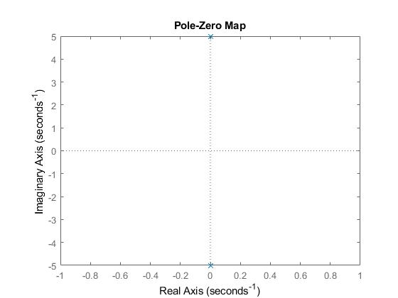

De acordo com o mapa de posição, pode-se concluir que a função de transferência é classificada como um caso crítico. A figura abaixo apresenta o modelo de simulação criado no `Simulink`.

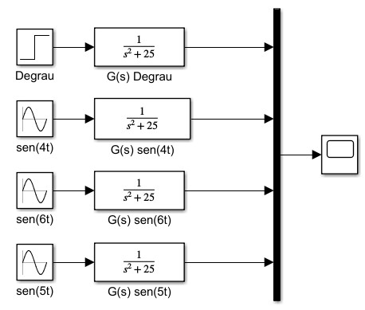

O resultado da simulação é apresentado abaixo.

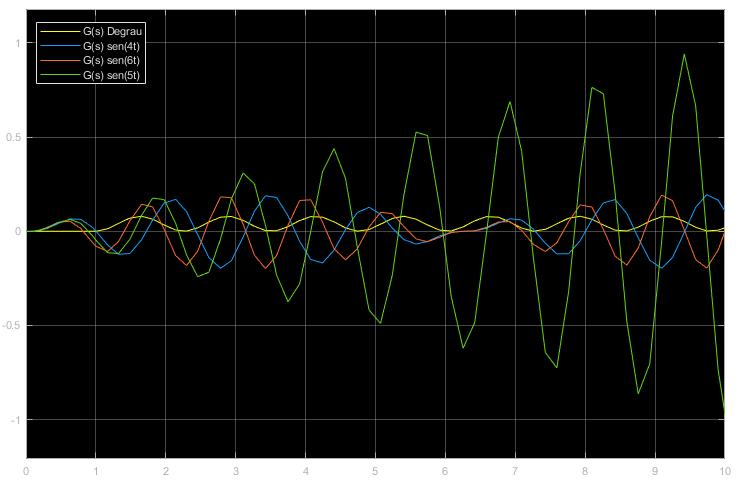

É fácil perceber que o modelo se comporta de maneira instável com a entrada $u(t) = \sin(5t)$, se mostrando estável nas demais situações.

### Problema 4{-}

Considere o sistema de segunda orde
$$
G(s) = \frac {1.6}{(s+1)(s+2)} = \frac {0.8}{0.5s^2+1.5s+1}.
$$

Determine os pólos e suas posições no plano $s$ e simule para uma entrada do tipo degrau unitário. Note que não há sobressinal. Tal resultado era esperado? Justifique.

Agora, adicionando um zero, temos
$$
G(s) = \frac {1.6(\beta s+1)}{(s+1)(s+2)} = \frac {0.8(\beta s+1)}{0.5s^2 +1.5s +1},
$$
onde $\beta = 0.1$, $\beta = 0.6$, $\beta = 0.99$, $\beta = 1.2$, $\beta = 2$, $\beta = 10$. Para cada valor de $\beta$, determine os pólos e zeros, suas posições no plano $s$ e simule para uma entrada do tipo degrau unitário. Analise e compare os resultados. Note que dependendo da posição do zero o sobressinal será maior ou menor, podendo também não estar presente.

#### Resolução{-}

Utilizando a função `pzmap()` do `Matlab` para encontrar os pólos da função de transferência $G(s) = \frac {0.8}{0.5s^2+1.5s+1}$ temos que a função não possui zeros e possui polos para $s = -2$ e $s = -1$. O mapa de posições é apresentado na figura abaixo.

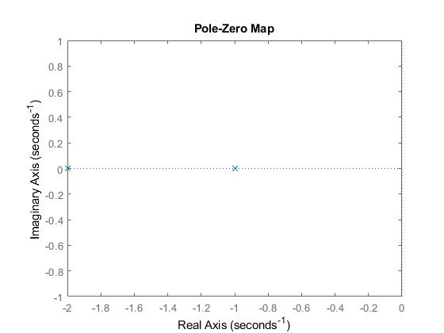

O resultado da função de transferência é apresentado na figura abaixo.


Agora, considerando a função de transferência
$$
G(s) = \frac {0.8(\beta s+1)}{0.5s^2+1.5s+1},
$$
e substituindo os valores de $\beta$ pelos valores propostos temos os valores de zero e pólo apresentados na tabela abaixo.

```{r, echo=FALSE}
resultados <- data.frame("Pólos" = c("{-2, -1}",
                                   "{-2, -1}",
                                   "{-2, -1}",
                                   "{-2, -1}",
                                   "{-2, -1}",
                                   "{-2, -1}"),
                         Zeros = c("-10.0", "-1.67",
                                   "-1.01", "-0.83",
                                   "-0.50", "-0.10"))
rownames(resultados) <- c("$\\beta = 0.1$", "$\\beta = 0.6$", "$\\beta = 0.99$", "$\\beta = 1.2$", "$\\beta = 2$", "$\\beta = 10$")
knitr::kable(resultados, booktabs = T, escape = FALSE, caption = "Valores de Pólo e Zero variando $\\beta$")
```

Os gráficos de posição estão apresentados abaixo.

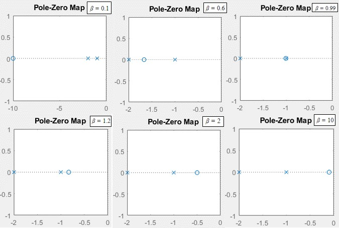

A simulação feita em `Matlab` está apresentada na figura abaixo.

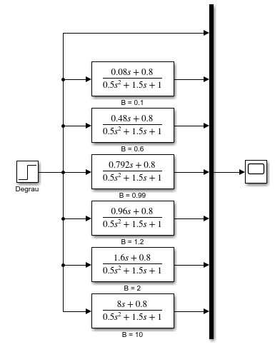

O resultado da simulação está apresentado na figura abaixo.

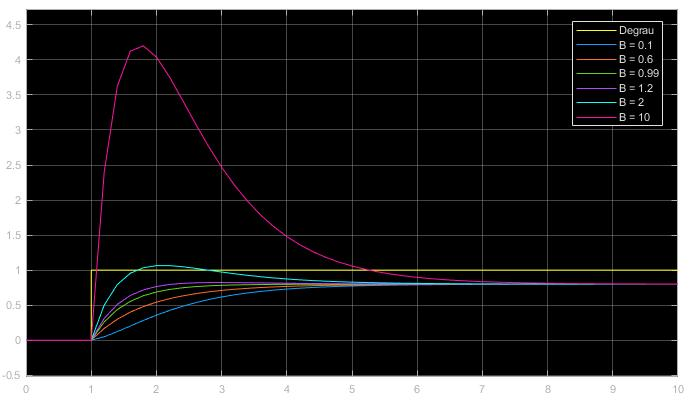

É possível perceber que quanto mais alto o valor de $\beta$ maior o sobressinal. Também é possível perceber que há um intervalo no qual o tempo de reação aumenta, encontrando seu tempo de reação mínimo, voltando então a aumentar.

### Problema 5{-}

Considere o sistema de segunda ordem
$$
G(s) = \frac {0.9}{s^2+s+1}.
$$

Determine os pólos e suas posições no plano $s$ e simule para uma entrada do tipo degrau unitário. Note que há sobressinal. Tal resultado era esperado? Justifique.

Agora, adicionando um zero, temos
$$
G_z(s) = \frac {0.9(\beta s+1)}{s^2+s+1},
$$
onde $\beta = 0.05$, $\beta = 0.5$, $\beta = 1$ e $\beta = 2.5$. Para cada valor de $\beta$ determine os pólos e zeros, suas posições no plano $s$ e simule para uma entrada do tipo degrau unitário. Analise e compare os resultados.

#### Resolução{-}

Utilizando a função `pzmap()` do `Matlab` para encontrar os pólos da função de transferência $G(s) = \frac {0.9}{s^2+s+1}$ temos que a função não possui zeros e possui polos para $s = -0.5 + 0.86i$ e $s = -0.5 -0.86i$. O mapa de posições é apresentado na figura abaixo.

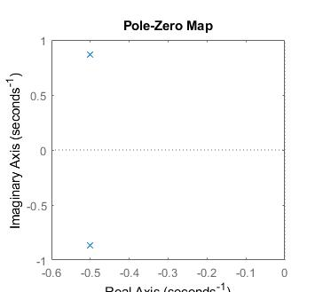

O resultado da função de transferência é apresentado na figura abaixo.


É possível perceber que há sobressinal.

Agora, considerando a função de transferência $G_z(s) = \frac {0.9(\beta s+1)}{s^2+s+1}$, e substituindo os valores de $\beta$ pelos valores propostos temos os valores de zero e pólo apresentados na tabela abaixo.

```{r, echo=FALSE}
resultados <- data.frame("Pólos" = c("{$-0.5 \\pm 0.86i$}",
                                     "{$-0.5 \\pm 0.86i$}",
                                     "{$-0.5 \\pm 0.86i$}",
                                     "{$-0.5 \\pm 0.86i$}"),
                         Zeros = c("-20.0", "-2.0",
                                   "-1.0", "-0.4"))
rownames(resultados) <- c("$\\beta = 0.05$", "$\\beta = 0.5$", "$\\beta = 1$", "$\\beta = 2.5$")
knitr::kable(resultados, booktabs = T, escape = FALSE, caption = "Valores de Pólo e Zero variando $\\beta$")
```

Os gráficos de posição estão apresentados abaixo.

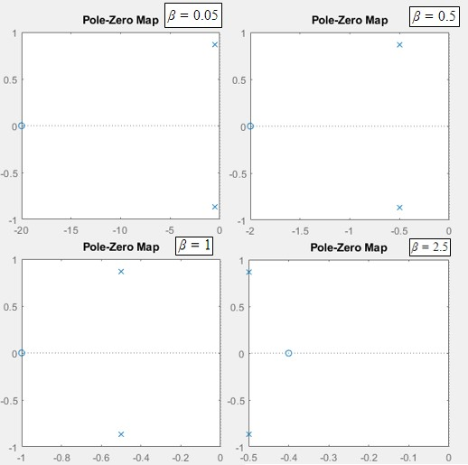

A simulação feita em `Matlab` está apresentada na figura abaixo.

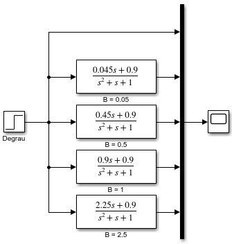

O resultado da simulação está apresentado na figura abaixo.

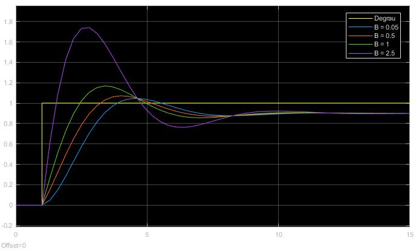

É possível perceber que quanto mais alto o valor de $\beta$ maior o sobressinal e o tempo de resposta do sistema.

### Problema 6{-}

Considere o sistema de segunda ordem de fase não-mínima
$$
G(s) = \frac {-s+1}{0.5s^2+1.5s+1}.
$$

Determine os pólos e o zero, suas posições no plano $s$ e simule para uma entrada do tipo degrau unitário. Note que a resposta é negativa nos instantes iniciais. Justificaremos tal comportamento no que se segue.

Escrevemos
$$
G(s) = \frac {-s+1}{0.5s^2+1.5s+1} = \overbrace{\frac {1}{0.5s^2+1.5s+1}}^{G_1(s)} - \overbrace{\frac {s}{0.5s^2+1.5s+1}}^{G_2(s) = sG_1(S)}.
$$

Assim,
$$
Y(s) = G(s)U(s) = G_1(s)U(s)-G_2(s)U(s) = \underbrace{G_1(s)U(s)}_{Y_1(s)} - \underbrace{sG_1(s)U(s)}_{Y_2(s) = sY_1(s)}.
$$

Relembre-se que se $x(t) \iff X(S)$ com $x(0) = 0$, então $dx(t)/dt \iff sX(s)$. Portanto,
$$
y(t) = y_1(t)-y_2(t)=y_1(t)- \frac {dy_1(t)}{dt}.
$$

Verifique a validade da equação acima no Simulink (utilize o bloco **Derivative** no Simulink) para uma entrada do tipo degrau unitário. Analise o motivo da resposta ser negativa nos instantes iniciais.

#### Resolução {-}

\begin{align}
    r  = \frac{1}{n-1} \sum_{i=1}^{n} \frac{(X_i - \bar{X})(Y_i - \bar{Y})}{S_xS_y}
\end{align}