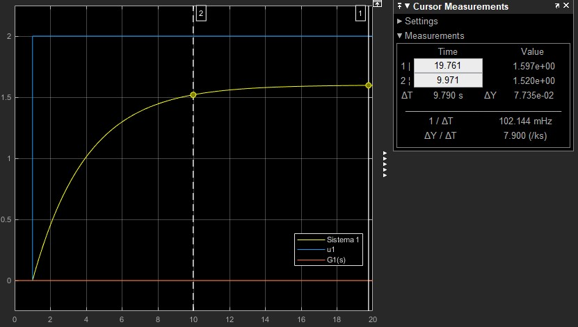
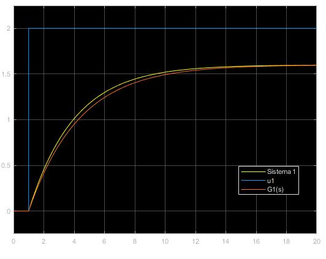
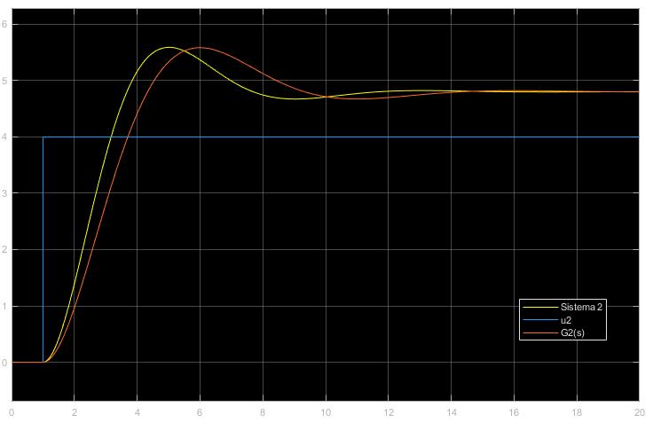
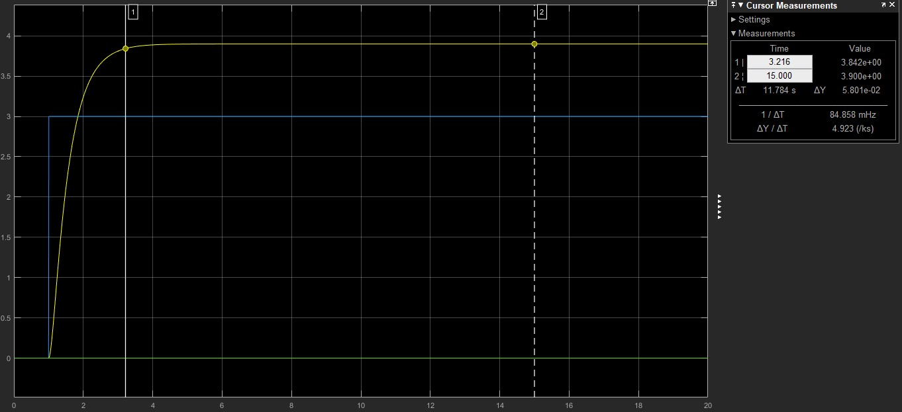
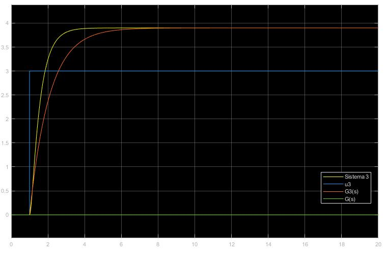
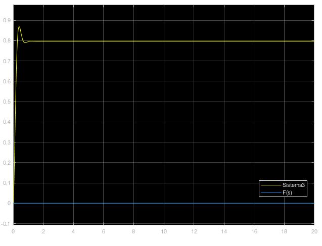
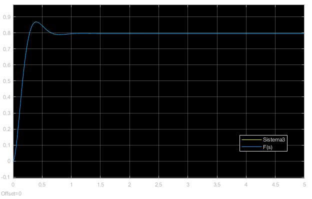
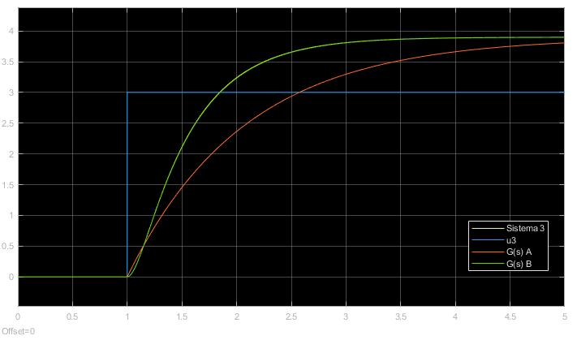

# Problemas Laboratório 3 {-}

Estes problemas são relacionados ao assunto abordado no Laboratório \@ref(lab3).

## Problema 3.1 {-}

Aplique um degrau $u(t) = 2$ no Sistema 1 do arquivo `MatLab3.mdl` do Simulink. Pelas características da resposta, modele o Sistema 1 como uma Função de Transferência $G_1(s)%$ de primeira ou segunda ordem. Em seguida, identifique os parâmetros do modelo utilizando a equação \@ref(eq:eq32) ou \@ref(eq:eq34). Compare a resposta do modelo identificado com a do Sistema 1.

#### Resolução {-}

Simulando o sistema do modelo 1 obtemos o resultado abaixo.



Pela curva feita espera-se que a Função de Transferência seja de primeira ordem. Utilizando as ferramentas fornecidas pelo `Simulink` foi estimado que
$$
y(\infty) = 1.6 \\ 
0.95y(\infty) = 1.52 \implies  t_s(5\%) = 9.97s \implies \tau = 3.33
$$

Assim,
$$
G_1(s) = \frac {0.8}{3.33s+1}.
$$

Simulando $G_1(s)$, temos o resultado apresentado abaixo.



Percebe-se, assim, que a Função de Transferência $G_1(s)$ se aproxima satisfatoriamente bem do Sistema 1.

## Problema 3.2 {-}

Aplique um degrau $u(t) = 4$ no Sistema 2. Pelas características da resposta modele o Sistema 2 como uma Função de Transferência $G_2(s)$ de primeira ou segunda ordem. Em seguida, identifique os parâmetros do modelo utilizando a equação \@ref(eq:eq32) ou \@ref(eq:eq34). Realize os cálculos na linha de comando do `Matlab` ($\ln{(x)} \implies \log{(x)}$ e $\sqrt{x} \implies \text{sqrt(x)}$).Compare a resposta do modelo identificando com a do Sistema 2.

#### Resolução {-}

Simulando o sistema do modelo 1 obtemos o resultado abaixo.


Pela curva feita espera-se que a Função de Transferência seja de segunda ordem. Utilizando as ferramentas fornecidas pelo `Simulink` foi estimado que
$$
y_p = 5.588 \\  
y(\infty) = 4.805 \\  
t_p = 5s
$$

Dessa forma, aplicando as equações 3.4, temos que
$$
K = 1.2, \quad M_p = 0.163, \quad \xi = 0.5 \quad \text{e} \quad \omega_n = 0.7255.
$$

Dessa forma, a Função de Transferência $G_2(s)$ será
$$
G_2(s) = \frac {0.6316}{s^2 + 0.7255s + 0.5264}.
$$
Simulando $G_2(s)$, temos o resultado apresentado abaixo.



Percebe-se, assim, que a Função de Transferência $G_2(s)$ se assemelha ao Sistema 2,porém, com menor precisão que a função $G_1(s)$ se aproximou do Sistema 2.

## Problema 3.3 {-}

#### Parte A{-}

Aplique um degrau $u(t) = 3$ no Sistema 3. Obtenha um modelo aproximado para o Sistema 3 como uma Função de Transferência $G(s)$ de primeira ordem. Agora implemente o diagrama de blocos em malha fechada da Figura 3 para o Sistema 3 com $r(t) = 1$ do tipo degrau e $K_c = 3$Observamos que, na Figura 3, se $G(s)$ é de primeira ordem, então a Função de Transferência em malha fechada $F(s)$ também será de primeira ordem para qualquer valor de $K_c > 0$. A resposta do Sistema 3 em malha-fechada está de acordo com tal propriedade? O que pode estar errado?

##### Resolução {-}

Simulando o sistema do modelo 1 obtemos o resultado abaixo.



Pela curva feita espera-se que a Função de Transferência seja de primeira ordem. Utilizando as ferramentas fornecidas pelo `Simulink` foi estimado que
$$
y(\infty) = 3.9 \\ 
0.95y(\infty) = 3.8415 \implies  t_s(5\%) = 3.22s \implies \tau = 1.072
$$

Assim,
$$
G_3(s) = \frac {1.3}{1.072s+1}.
$$

Simulando $G_1(s)$, temos o resultado apresentado abaixo.



Percebe-se, assim, que a Função de Transferência $G_B(s)$ não se aproxima satisfatoriamente bem ao Sistema 3. Aplicando a malha fechada vista na figura 3, temos o resultado apresentado abaixo.



Como $K_c = 3 > 0$ e a Função de Transferência em malha fechada retornou um sistema de segunda ordem, percebe-se a resposta não está de acordo com a propriedade estabelecida. Desta forma, presume-se que $G(s)$ não é de primeira ordem e sim de segunda.

#### Parte B{-}

Identifique $F(s)$. Em seguida, identifique $G(s)$indiretamente através da equação \@ref(eq:eq55). Para isto, utilize os seguintes comandos no `Matlab`:

```{matlab}
F = tf([K*wn^2], [1 2*ksi*wn wn^2])
G = F/(Kc-Kc*F)
G = zpk(minreal(G)) % minreal simplifica e zpk fatora
```

Note que $G(s)$ é de segunda ordem com pólos reais. Neste momento, temos condições de responderm o que estava errado em nossa modelagem inicial do Sistema 3 como um sistema de primeira ordem. Compare a resposta em malha-aberta de $G(s)$ (identificando indiretamente) com a do Sistema 3 para $u(t) = 3$ do tipo degrau.

##### Resolução {-}

Simulando o sistema do Sistema 3 em malha fechada e utilizando as ferramentas fornecidas pelo `Simulink` foi estimado que
$$
y_p = 0.868 \\ 
y(\infty) = 0.796 \\ 
t_p = 0.4s
$$

Assim, tem-se que:
$$
K = 0.796, \quad M_p = 0.09, \quad \xi = 0.61 \quad \text{e} \quad \omega_n= 9.888.
$$

Dessa forma, tem-se que
$$
F(s) = \frac {77.83}{s^2+ 12.01s +97.77}
$$
que gera a curva abaixo.



Assim, é possível calcular $G(s)$ a partir de $F(s)$, tendo como resultado
$$
G(s) = \frac {25.94}{s^2+12.025s+19.96}.
$$

Agora é possível comprar $G(s)$ com sua curva anterior, gerando o resultado abaixo.



Percebe-se que, considerando o modelo como uma Função de Transferência de segundo grau obtida através de $F(s)$ é possível encontrar a curva exata correspondente ao Sistema 3.