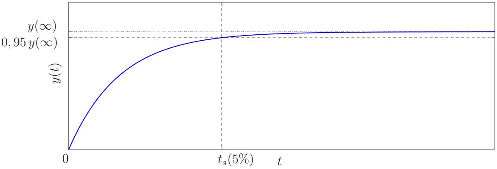
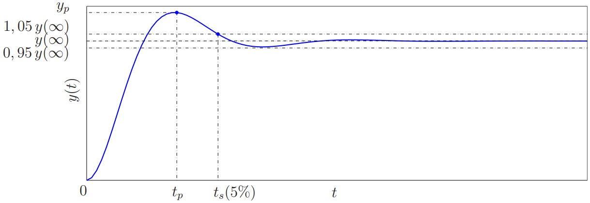
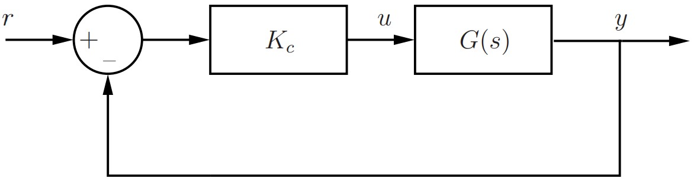

# Identificação de Sistemas

Nesta experiência, veremos como modelar matematicamente um sistema linear por uma Função de Transferência. Identificaremos os parâmetros de uma Função de Transferência de primeira e de segunda ordem. Compararemos a dinâmica do sistema com a do modelo matemático.

## Modelagem de Sistemas Lineares 

Encontrar um modelo matemático que capture as características dinâmicas relevantes de um sistema real é de fundamental importância para a análise e controle do sistema. No Laboratório 1 estudamos um modelo linear com motor CC. Tal modelo pode ser obtido a partir das leis da física (mecânica e eletromagnetismo) e os valores dos parâmetros dependem de constantes e coeficientes físicos (indutância do enrolamento, resistência do enrolamento, constante de torque do motor, coeficiente de atrito ciscoso). Em situações reais, não conheceremos uma estimativa para os mesmos. Por exemplo, todo resistor possui um valor normal e uma faixa de tolerância percentual (e.g. $R = 100 \Omega \pm 5\%$). Além disso, muitas vezes a determinação de um modelo matemático para um sistema a partir de leis naturais é extremamente difícil e, mesmo no caso em que isso é possível, o modelo obtido pode ser demasiadamente complexo para ser estudado matematicamente.

Devido às dificuldades que acabamos de expor, em geral buscamos um modelo matemático relativamente simples mas que capture, ao menos aproximadamente, as características dinâmicas relevantes do sistema. Assim, primeiramente fixamos um modelo (*modelagem* do sistema) e em seguida determinamos de maneira aproximada o valor de seus parâmetros (*identificação* dos parâmetros).

Nesta experiência, consideraremos apenas sistemas lineares que possam ser modelados por uma função de Transferência $G(s)$ de primeira ordem ou de segunda ordem. Veremos então como identificar os parâmetros de $G(s)$.

## Identificação de sistemas de primeira ordem 

Toda Função de Transferência $G(s)$ de primeira ordem pode ser escrita na forma padrão como

\begin{align}
G(s) = \frac{K}{\tau s+1}. (\#eq:eq31)
\end{align}

Supunha que $G(s)$ é estável, ou seja, $\tau > 0$. considere uma entrada $u(t) = A$ do tipo degrau de magnitude $A$. Temos que a saída correspondente é
$$
y(t) = AK(1- e^{\frac {-t}{\tau}}).
$$

O valor da saída em regime permanente é
$$
y(\infty) = AK,
$$
e o tempo de acomodação de $5\%$ é dado por
$$
0.95KA = KA(1- e^{\frac {-t_s(5\%)}{\tau}}) \implies t_s(5\%) =3 \tau.
$$

Isto é ilustrado na figura 1.



Logo,

\begin{align}
K = \frac{y(\infty)}{A},  \tau = \frac {t_s(5\%)}{3}. (\#eq:eq32)
\end{align}

## Identificação de Sistemas de Segunda Ordem 

Toda Função de Transferência $G(s)$ de segunda ordem com pólos não-nulos pode ser escrita como

\begin{align}
G(s) = \frac {K \omega_n^2}{s^2+2\xi \omega_n+ \omega_n^2}, (\#eq:eq33)
\end{align}

onde $\omega_n > 0$. Os pólos de $G(s)$ são:
$$
p_{1,2} = - \xi \omega_n \pm \sqrt{\xi^2 -1}.
$$

Temos as seguintes situações:

1. Sistema não-amortecido ($\xi = 0$): os pólos são complexos com $p_{1,2} = \pm j \omega_n$, e a resposta a uma entrada do tipo degrau é senoidal.
2. Sistema sub-amortecido ($0< \xi <1$): os pólos são complexos com $p_{1,2} = - \xi \omega_n \pm j \omega_n\sqrt{1 - \xi^2}$ e a resposta ao degrau apresenta oscilação e sobressinal.
3. Sistema criticamente amortecido ($\xi = 1$): os pólos são reais e iguais com $p_{1,2} = -\xi \omega_n$ e a resposta ao degrau não apresenta oscilação nem sobressinal.
4. Sistema super-amortecido ($\xi >1$): os pólos são reais, negativos e diferentes e a resposta ao degrau não apresenta oscilação nem sobressinal.
5. Sistema instável ($\xi < 0$): os pólos possuem parte real positiva.

#### Sistemas sub-amortecidos {-}

Suponha que $G(s)$ é estável com $0 < \xi < 1$ (sub-amortecido). Considere uma entrada $u(t) = A$ do tipo degrau de magnitude $A$. A resposta correspondente $y(t)$ é ilustrada na figura 2.



Temos que
$$
y(\infty) = KA, \quad M_p= \frac {y_p-y(\infty)}{y(\infty)} = e^{\frac {-(\xi \pi)}{\sqrt{1-\xi^2}}}, \quad
t_p = \frac {\pi}{\omega_n\sqrt{1-\xi^2}}.
$$

Logo,

\begin{align}
K = \frac {y(\infty)}{A}, \quad M_p = \frac {y_p - y(\infty)}{y(\infty)}, \quad \xi = \sqrt{\frac {(\ln{M_p})^2}{(\ln{M_p})^2+\pi^2}}, \quad \omega_n = \frac {\pi}{t_p\sqrt{1-\xi^2}}.  (\#eq:eq34)
\end{align}

#### Sistemas criticamente amortecidos e super-amortecidos {-}

Suponha que $G(s)$ é estável com $\xi \geq 1$ (criticamente amortecido ou super-amortecido). Neste caso, os dois pólos de $G(s)$ são reais e a resposta ao degrau se assemelha ao de um sistema de primeira ordem (não apresenta oscilação nem sobressinal). Podemos identificar $G(s)$ indiretamente através da identificação da Função de Transferência $F(s)$ em malha-fechada. Considere o diagrama de blocos em malha-fechada mostrando na Figura 3, onde $K_c > 0$ é o ganho de um controlador proporcional e $r$ é a referência.



Relembre que 
$$
F(s) = \frac {Y(s)}{R(s)} = \frac {K_cG(s)}{1+K_cG(s)}.
$$

Para qualquer $K_c > 0$, temos que $F(s)$ é um sistema de segunda ordem estável. E, quando $K_c > 0$ for suficientemente grade, temos que $F(s)$ será um sistema de segunda ordem sub-amortecido. Assim, escolhemos $K_c$ de modo que $F(s)$ seja sub-amortecido e então identificamos $F(s)$ conforme descrito na seção anterior aplicando uma referência $r(t) = A$ do tipo degrau de magnitude $A$. Desta maneira, identificaremos $G(s)$ indiretamente pois

\begin{align}
F(s) = \frac {K_cG(s)}{1+K_cG(s)} \implies G(s) = \frac {F(s)}{K_c - K_cF(s)}.  (\#eq:eq35)
\end{align}

## Procedimentos Lab 3 {-}

### Problema 1 {-}

Aplique um degrau $u(t) = 2$ no Sistema 1 do arquivo `MatLab3.mdl` do Simulink. Pelas características da resposta, modele o Sistema 1 como uma Função de Transferência $G_1(s)%$ de primeira ou segunda ordem. Em seguida, identifique os parâmetros do modelo utilizando a equação \@ref(eq:eq32) ou \@ref(eq:eq34). Compare a resposta do modelo identificado com a do Sistema 1.

#### Resolução {-}

Simulando o sistema do modelo 1 obtemos o resultado abaixo.


Pela curva feita espera-se que a Função de Transferência seja de primeira ordem. Utilizando as ferramentas fornecidas pelo `Simulink` foi estimado que
$$
y(\infty) = 1.6 \\
0.95y(\infty) = 1.52 \implies  t_s(5\%) = 9.97s \implies \tau = 3.33
$$

Assim,
$$
G_1(s) = \frac {0.8}{3.33s+1}.
$$

Simulando $G_1(s)$, temos o resultado apresentado abaixo.


Percebe-se, assim, que a Função de Transferência $G_1(s)$ se aproxima satisfatoriamente bem do Sistema 1.

### Problema 2{-}

Aplique um degrau $u(t) = 4$ no Sistema 2. Pelas características da resposta modele o Sistema 2 como uma Função de Transferência $G_2(s)$ de primeira ou segunda ordem. Em seguida, identifique os parâmetros do modelo utilizando a equação \@ref(eq:eq32) ou \@ref(eq:eq34). Realize os cálculos na linha de comando do `Matlab` ($\ln{(x)} \implies \log{(x)}$ e $\sqrt{x} \implies \text{sqrt(x)}$).Compare a resposta do modelo identificando com a do Sistema 2.

#### Resolução {-}

Simulando o sistema do modelo 1 obtemos o resultado abaixo.


Pela curva feita espera-se que a Função de Transferência seja de segunda ordem. Utilizando as ferramentas fornecidas pelo `Simulink` foi estimado que
$$
y_p = 5.588\\
y(\infty) = 4.805 \\
t_p = 5s
$$

Dessa forma, aplicando as equações 3.4, temos que
$$
K = 1.2, \quad M_p = 0.163, \quad \xi = 0.5 \quad \text{e} \quad \omega_n = 0.7255.
$$

Dessa forma, a Função de Transferência $G_2(s)$ será
$$
G_2(s) = \frac {0.6316}{s^2 + 0.7255s + 0.5264}.
$$
Simulando $G_2(s)$, temos o resultado apresentado abaixo.


Percebe-se, assim, que a Função de Transferência $G_2(s)$ se assemelha ao Sistema 2,porém, com menor precisão que a função $G_1(s)$ se aproximou do Sistema 2.

### Problema 3{-}

#### Parte A{-}

Aplique um degrau $u(t) = 3$ no Sistema 3. Obtenha um modelo aproximado para o Sistema 3 como uma Função de Transferência $G(s)$ de primeira ordem. Agora implemente o diagrama de blocos em malha fechada da Figura 3 para o Sistema 3 com $r(t) = 1$ do tipo degrau e $K_c = 3$Observamos que, na Figura 3, se $G(s)$ é de primeira ordem, então a Função de Transferência em malha fechada $F(s)$ também será de primeira ordem para qualquer valor de $K_c > 0$. A resposta do Sistema 3 em malha-fechada está de acordo com tal propriedade? O que pode estar errado?

##### Resolução {-}

Simulando o sistema do modelo 1 obtemos o resultado abaixo.


Pela curva feita espera-se que a Função de Transferência seja de primeira ordem. Utilizando as ferramentas fornecidas pelo `Simulink` foi estimado que
$$
y(\infty) = 3.9 \\
0.95y(\infty) = 3.8415 \implies  t_s(5\%) = 3.22s \implies \tau = 1.072
$$

Assim,
$$
G_3(s) = \frac {1.3}{1.072s+1}.
$$

Simulando $G_1(s)$, temos o resultado apresentado abaixo.


Percebe-se, assim, que a Função de Transferência $G_B(s)$ não se aproxima satisfatoriamente bem ao Sistema 3. Aplicando a malha fechada vista na figura 3, temos o resultado apresentado abaixo.


Como $K_c = 3 > 0$ e a Função de Transferência em malha fechada retornou um sistema de segunda ordem, percebe-se a resposta não está de acordo com a propriedade estabelecida. Desta forma, presume-se que $G(s)$ não é de primeira ordem e sim de segunda.

#### Parte B{-}

Identifique $F(s)$. Em seguida, identifique $G(s)$indiretamente através da equação \@ref(eq:eq55). Para isto, utilize os seguintes comandos no `Matlab`:

```{matlab}
F = tf([K*wn^2], [1 2*ksi*wn wn^2])
G = F/(Kc-Kc*F)
G = zpk(minreal(G)) % minreal simplifica e zpk fatora
```

Note que $G(s)$ é de segunda ordem com pólos reais. Neste momento, temos condições de responderm o que estava errado em nossa modelagem inicial do Sistema 3 como um sistema de primeira ordem. Compare a resposta em malha-aberta de $G(s)$ (identificando indiretamente) com a do Sistema 3 para $u(t) = 3$ do tipo degrau.

##### Resolução {-}

Simulando o sistema do Sistema 3 em malha fechada e utilizando as ferramentas fornecidas pelo `Simulink` foi estimado que
$$
y_p = 0.868 \\
y(\infty) = 0.796 \\
t_p = 0.4s
$$

Assim, tem-se que:
$$
K = 0.796, \quad M_p = 0.09, \quad \xi = 0.61 \quad \text{e} \quad \omega_n= 9.888.
$$

Dessa forma, tem-se que
$$
F(s) = \frac {77.83}{s^2+ 12.01s +97.77}
$$
que gera a curva abaixo.


Assim, é possível calcular $G(s)$ a partir de $F(s)$, tendo como resultado
$$
G(s) = \frac {25.94}{s^2+12.025s+19.96}.
$$

Agora é possível comprar $G(s)$ com sua curva anterior, gerando o resultado abaixo.


Percebe-se que, considerando o modelo como uma Função de Transferência de segundo grau obtida através de $F(s)$ é possível encontrar a curva exata correspondente ao Sistema 3.