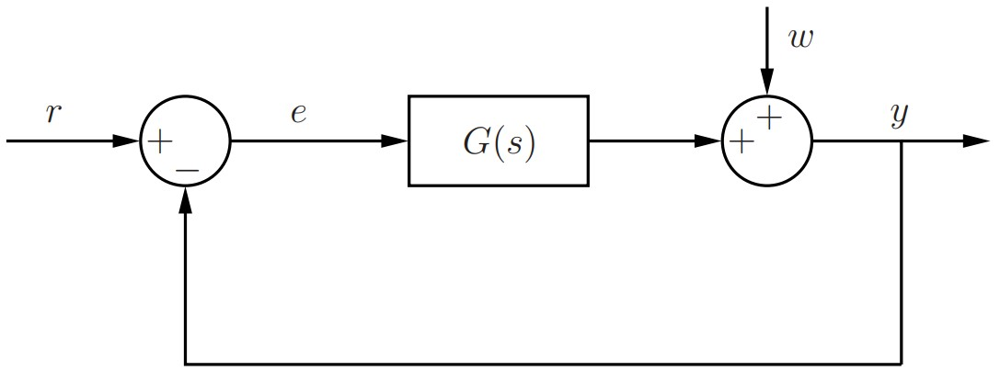
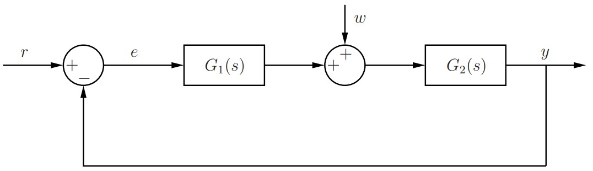

# Rastreamento de Referências e Rejeição de Perturbações - Erro em Regime Permanente 

## Apresentação do Laboratório

### Objetivos

Nesta experiência analisaremos o erro em regime permanente de sistemas em malha-fechada para o rastreamento de referências e a rejeição de perturbações. Consideraremos referências e perturbações do tipo degrau, rampa e parábola. Comprovaremos os resultados teóricos através de simulações no Simulink/Matlab.

### Tipos de Sistemas

Considere a Função de Transferência
$$
G(s) = \frac {N(s)}{D(s)}
$$
onde $N(s)$ e $D(s)$ são polinômios em $s$ sem raízes em comum e com $\text{grau}(N) \leq \text{grau}(D)$. Temos a seguinte classificação para $G(s)$:

-Tipo 0: $G(s)$ não possui pólos em $s=0$. Denominamos $K_p = G(0)$ de *constante de posição*. Note que $K_p = \lim\limits_{s \to 0} G(s)$.
- Tipo 1: $G(s)$ tem um (e apenas um) pólo em $s=0$. Podemos então escrever
$$
G(s) = \frac {1}{s}G_0(s),
$$
onde $G_0(s) = \frac {N(s)}{D_0(s)}$ não possui pólos em $s=0$. Chamamos $K_v= G_0(0) \neq 0$ de *constante de velocidade*. Note que $K_v = \lim\limits_{s \to 0} sG(s)$.
- Tipo 2: $G(s)$ tem dois (e apenas dois) pólos em $s=0$. Podemos escrever
$$
G(s) = \frac {1}{s^2}G_0(s),
$$
onde$G_0(s) = \frac {N(s)}{D_0(s)}$ não possui pólos em $s=0$. Denominamos $K_a = G_0(0) \neq 0$ de *constante de aceleração*. Note que $K_a =\lim\limits_{s \to 0} s^2G(s)$.

### Erro em regime permanente

Considere o sistema em malha-fechada com realimentação unitária mostrado na Figura 1, onde:
$$
\begin{cases}
  y(t) & \quad \text{: saída}\\
  r(t) & \quad \text{: referência}\\
  e(t) = r(t)-y(t) & \quad \text{: erro de rastreamento}\\
  w(t) &\quad \text{: perturbação externa que não é possível de ser medida}
\end{cases}
$$



Desejamos analisar o erro em regime permanente ($t \to \infty$) quando existem perturbações externas. Temos que

$$
E(s) = R(s) - Y(s) = R(s) - [G(s)E(s) + W(s)]\\
\implies E(s) = \frac {1}{1 + G(s)}R(s) - \frac {1}{1+G(s)}W(s) \\
\implies E(s) = \underbrace{\frac {D(s)}{D(s) + N(s)}R(s)}_{E_R(s)} - \underbrace{\frac {D(s)}{D(s) + N(s)}W(s)}_{Y_W(s)}
$$

Note que $E = E_R$ quando $W= 0$ e que $Y = Y_W$ quando $R=0$. Podemos então analisar $E$ através de $E_R$ e $Y_R$. O erro em regime permanente é dado por

\begin{align}
e(\infty) = \lim\limits_{t \to \infty}{e(t)} = e_r(\infty) - y_w(\infty), (\#eq:eq41)
\end{align}

desde que os limites $e_r(\infty) = \lim\limits_{t\to \infty}{e_r(t)}$ e $y_w(\infty) = \lim\limits_{t \to \infty}{y_w(t)}$ existam. Dezemos que há *rastreamento de referência* quando $e_r(\infty) = 0$. De maneira semelhante, dizemos que há *rejeição de perturbação* quando $y_w(\infty) = 0$. Portanto, quando há rastreamento de referência e rejeição de perturbação teremos que $e(\infty) = 0$.

Iremos agora analisar $e_r(\infty)$ e $y_w(\infty)$ através de $E_R(s)$ e $Y_W(s)$, respectivamente, considerando que a referência $r$ e a perturbação externa $w$ são do tipo degrau, rampa ou parábola. Relembramos que:

1. Degrau: $x(t) = A \iff X(s) = \frac {A}{s}$
2. Rampa: $x(t) = Bt \iff X(s) = \frac {B}{s^2}$
3. Parábola: $x(t) = Ct^2 \iff X(s) = \frac {2C}{s^3}$

Suponha que $D(s) + N(s) = 0$ possui todas as raízes no SPE (Semi-Plano Esquerdo do plano $s$) e que $D(s)R(s)$ e $D(s)W(s)$ possuem no máximo um pólo em $s=0$. Isto garante que $e_r(\infty)$ e $y_w(\infty)$ existem e, assim, o Teorema do Valor Final pode ser aplicado. Ressaltamos que as raízes de $D(s) + N(s) = 0$ nada mais são do que os pólos da Função de Transferência de malha-fechada quando não há perturbação ($w=0$)
$$
F(s) = \frac {Y(s)}{R(s)} = \frac{G(s)}{1+G(s)} = \frac {N(s)}{D(s)+N(s)}, \quad \text{(para } w=0 \text{).}
$$

Desse modo, estamos assumindo que $F(s)$ é estável para $w=0$. Com base no Teorema do Valor Final, podemos construir a tabela \@ref(tab:tab1) e a tabela \@ref(tab:tab2) mostradas abaixo. Note que os valores de $e_r(\infty)$ e de $y_w(\infty)$ (regime permanente) dependem apenas da constante de posição $K_p$, da constante de velocidade $K_v$ e da cosntante de aceleração $K_a$. Tl nomenclatura tem origem em sistemas mecânicos de controle. Por exemplo, para um sistema Tipo 0 e $r(t)=A$ (degrau) temos que (Teorema do Valor Final)
$$
e_r(\infty) = \lim\limits_{s \to 0}{sE_R(s)}=\lim\limits_{s\to0}{\frac{D(s)}{D(s)+N(s)}\frac{A}{s}} = \lim\limits_{s\to0}{\frac{AD(s)}{D(s)+N(s)}} \\
= \frac{AD(0)}{D(0) + N(0)} = \frac{A}{1+N(0)/D(0)} = \frac{A}{1+G(0)} = \frac {A}{1+K_p}.
$$
pois como $D(0) + N(0) \neq 0$ ($F(s)$ é estável) e $D(0) \neq 0$ ($G(0)$ é de Tipo 0) não há divisão por zero!

E, para um sistema Tipo 2 e $r(t) = Bt$ (rampa), temos $G(s) = \frac{N(s)}{D(s)} = \frac{N(s)}{s^2D_0(s)}$ e
$$
e_r(\infty) = \lim\limits_{s \to 0}{sE_r(s) = \lim\limits_{s \to 0}{s\frac{D(s)}{D(s)+N(s)}\frac{B}{s^2}}} = \lim\limits_{s \to 0}{s\frac{s^2D_0(s)}{D(s)+N(s)}\frac{B}{s^2}}\\
=\lim\limits_{s \to 0}{\frac{sBD_0(s)}{D(s)+N(s)}}=\frac{0BD(0)}{N(0)+D(0)}=0,
$$
pois $D(0) + N(0) \neq 0$ ($F(s)$ é estável) e não há divisão por zero!

Observamos que a tabela \@ref(tab:tab1) e a tabela \@ref(tab:tab2) são válidas apenas para sistemas com realimentação unitária com perturbação na saída (veja a Figura 1) e tais que a Função de Transferência em malha-fechada é estável para $w=0$.

```{r tab1, echo=FALSE}
resultados <- data.frame(T1 = c("Tipo 0", "Tipo 1", "Tipo 2"),
                         T2 = c("$\\frac{A}{1 + K_p}$", "0", "0"),
                         T3 = c("$\\infty$", "$\\frac{B}{K_v}$", "0"),
                         T4 = c("$\\infty$", "$\\infty$", "$\\frac{2C}{K_a}$"))
colnames(resultados) <- c("Sistema $G(s)$ / Referência", "$r(t)=A$", "$r(t) = Bt$", "$r(t) = Ct^2$")
knitr::kable(resultados, booktabs = T, escape = FALSE, caption = "Valores de $e_r(\\infty)$ ($w=0$)")
```

```{r tab2, echo=FALSE}
resultados <- data.frame(T1 = c("Tipo 0", "Tipo 1", "Tipo 2"),
                         T2 = c("$\\frac{A}{1 + K_p}$", "0", "0"),
                         T3 = c("$\\infty$", "$\\frac{B}{K_v}$", "0"),
                         T4 = c("$\\infty$", "$\\infty$", "$\\frac{2C}{K_a}$"))
colnames(resultados) <- c("Sistema $G(s)$ / Perturbação", "$w(t)=A$", "$w(t) = Bt$", "$w(t) = Ct^2$")
knitr::kable(resultados, booktabs = T, escape = FALSE, caption = "Valores de $y_r(\\infty)$ ($r=0$ e $w$ na saída de $G(s)$)")
```

Agora, considere o sistema mostrado na Figura 2 e assuma que $G_2(s)$ não possui *zeros* em $s=0$. Para tal sistema, a Tabela \@ref(tab:tab1) continua válida para $G(s) = G_1(s)G_2(s)$. No entanto, a Tabela \@ref(tab:tab2) deve ser substituída pela Tabela \@ref(tab:tab3). Ressaltamos que os valores $\neq 0$ na Tabela \@ref(tab:tab3) podem ser calculados analiticamente a partir de $G_1(s) \text{ e } G_2(s)$. Entretanto, isso não é o objeto de estudo desta experiência.



```{r tab3, echo=FALSE}
resultados <- data.frame(T1 = c("Tipo 0", "Tipo 1", "Tipo 2"),
                         T2 = c("$\\neq 0$", "0", "0"),
                         T3 = c("$\\infty$", "$\\neq 0$", "0"),
                         T4 = c("$\\infty$", "$\\infty$", "$\\neq 0$"))
colnames(resultados) <- c("Sistema $G(s)$ / Perturbação", "$w(t)=A$", "$w(t) = Bt$", "$w(t) = Ct^2$")
knitr::kable(resultados, booktabs = T, escape = FALSE, caption = "Valores de $y_r(\\infty)$ ($r=0$ e $w$ na saída de $G_2(s)$)")
```

## Procedimentos

Working on it :)